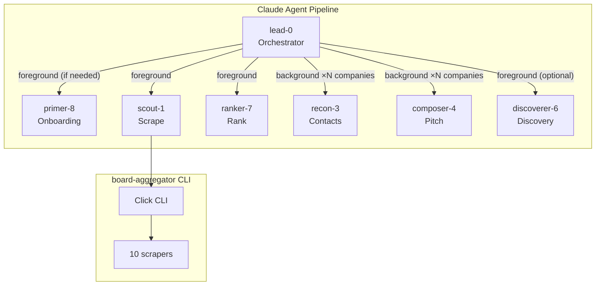

# agent-job-research

Agent pipeline that scrapes 10+ job boards, scores postings against your skills, finds hiring managers, and drafts personalized pitches. Anti-mass-apply.

## Quick Start

```bash
git clone https://github.com/0xQuinto/agent-job-research.git
cd agent-job-research
claude --agent lead-0
```

That's it. On first run, `lead-0` detects missing setup and walks you through everything:
- Installing prerequisites (Python 3.12+, git, Homebrew)
- Setting up the virtual environment and dependencies
- Configuring Exa MCP for contact research
- Building your skills inventory and resume from your existing materials (CV, portfolio, GitHub, LinkedIn)

**Manual alternative:** `python setup_wizard.py` handles venv + deps + Exa MCP without the profile builder.

## How the pipeline works

```
Phase 1 — Scrape       scout-1 runs board-aggregator CLI across 11 boards
Phase 2 — Rank         ranker-7 scores each posting against your skills inventory
Phase 3 — Research     recon-3 finds hiring managers via Exa + Chrome (parallel per company)
Phase 4 — Pitch        composer-4 generates video scripts + DM drafts (parallel per company)
```

The pipeline orchestrator (`lead-0`) runs phases sequentially. Within Phases 3 and 4, one subagent spawns per company in parallel.

**Optional pre-step:** Run `discoverer-6` to find companies matching your target profile and populate `portals.yml` for targeted ATS scanning in Phase 1.

Each run writes to a timestamped directory under `research/runs/`. The most recent run is symlinked at `research/latest/`.

## Architecture



## Adding a scraper

1. Create `board_aggregator/scrapers/your_board.py`
2. Subclass `BaseScraper` and implement `scrape()`
3. Decorate with `@register`
4. Import in `board_aggregator/cli.py`
5. Add a test with a fixture in `tests/`

See `board_aggregator/scrapers/remoteok.py` for a minimal example.

## Development

```bash
git clone https://github.com/0xQuinto/agent-job-research.git
cd agent-job-research
python -m venv .venv
.venv/bin/pip install -e ".[dev]"
.venv/bin/pytest
```

## License

MIT — see [LICENSE](LICENSE).
