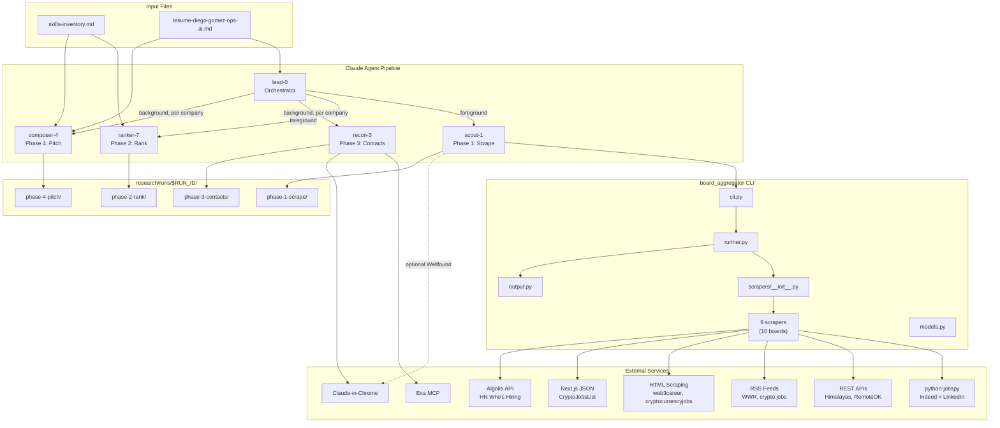
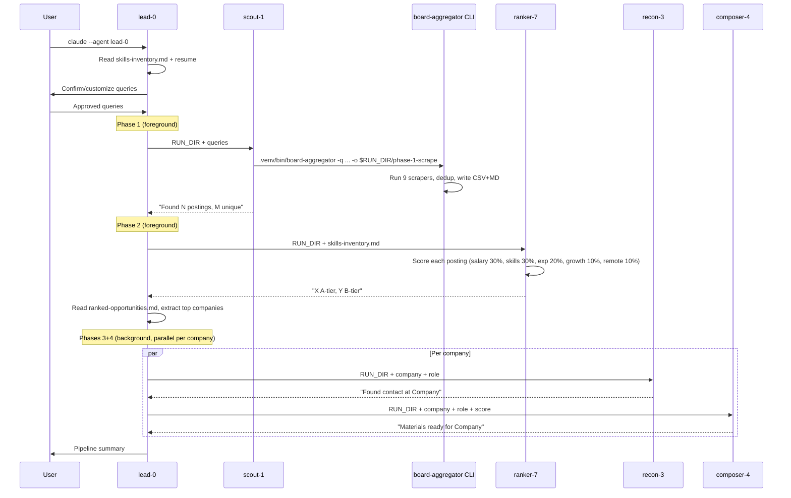

# Codebase Map

> Auto-generated by Cartographer. Last mapped: 2026-03-30

## System Overview



## Directory Structure

```
.
├── .claude/
│   ├── CLAUDE.md                  # Project instructions (survives context compaction)
│   ├── settings.local.json        # Pre-approved permissions for background agents
│   └── agents/
│       ├── lead-0.md              # Pipeline orchestrator (Opus)
│       ├── scout-1.md             # Phase 1 scraper (Sonnet)
│       ├── ranker-7.md            # Phase 2 scorer (Sonnet)
│       ├── recon-3.md             # Phase 3 contact finder (Sonnet)
│       ├── composer-4.md          # Phase 4 pitch generator (Opus)
│       └── discoverer-6.md       # Company discovery via Exa (Sonnet)
├── board_aggregator/              # Python package — job board scraping engine
│   ├── __init__.py                # Package init, __version__
│   ├── cli.py                     # Click CLI entrypoint (board-aggregator command)
│   ├── models.py                  # JobPosting Pydantic model + dedup_key
│   ├── output.py                  # CSV + Markdown writers
│   ├── runner.py                  # Orchestrates scrapers + portal scanner, dedup, output
│   ├── portal_scanner.py          # ATS API clients (Greenhouse, Ashby, Lever)
│   └── scrapers/
│       ├── __init__.py            # Registry pattern (@register decorator)
│       ├── base.py                # BaseScraper ABC
│       ├── jobspy_boards.py       # python-jobspy: Indeed, LinkedIn
│       ├── himalayas.py           # Himalayas REST API (paginated)
│       ├── weworkremotely.py      # We Work Remotely RSS (4 category feeds)
│       ├── hn_hiring.py           # HN Who's Hiring via Algolia API
│       ├── cryptojobslist.py      # CryptoJobsList via __NEXT_DATA__ JSON
│       ├── crypto_jobs.py         # crypto.jobs RSS + BS4 description parsing
│       ├── web3career.py          # web3.career HTML table parsing
│       ├── cryptocurrencyjobs.py  # cryptocurrencyjobs.co HTML card parsing
│       └── remoteok.py            # RemoteOK JSON API
├── tests/
│   ├── conftest.py                # Shared fixtures
│   ├── fixtures/                  # Real HTML/JSON/XML samples from live sites
│   ├── test_models.py             # Pydantic model + dedup_key tests
│   ├── test_output.py             # CSV/Markdown output tests
│   ├── test_runner.py             # Dedup logic tests
│   └── test_*.py                  # Per-scraper tests (mocked HTTP)
├── docs/
│   ├── CODEBASE_MAP.md            # Detailed architecture map (this file)
│   ├── exa-upgrade-plan.md        # Exa MCP upgrade plan (applied)
│   └── superpowers/plans/         # Implementation plans (historical)
├── research/                      # Pipeline run outputs (gitignored)
│   ├── runs/                      # Timestamped run directories
│   └── latest -> runs/...         # Symlink to most recent run
├── portals.yml                    # Targeted company registry (persistent)
├── skills-inventory.md            # Diego's skills (input to Phase 2 + 4)
├── resume-diego-gomez-ops-ai.md   # Tailored resume (input to Phase 4)
└── pyproject.toml                 # Python >=3.12, deps, CLI entrypoint
```

## Module Guide

### board_aggregator/cli.py

**Purpose:** Click CLI entrypoint registered as `board-aggregator` script.
**Entry point:** `main()` (Click command)
**Key behavior:** Imports all scraper modules inside `main()` to trigger registry, then calls `runner.run_all()`.
**Options:** `-q/--query` (multiple), `-o/--output-dir`, `-s/--scraper` (filter), `-p/--portals` (portals.yml), `--remote-only/--include-onsite`, `--list-scrapers`

### board_aggregator/runner.py

**Purpose:** Orchestrates board scrapers + portal scanner, deduplicates results, writes output.
**Exports:** `run_all()`, `collect_from_boards()`, `deduplicate()`
**Dedup logic:** Key = `(title.strip().lower(), company.strip().lower())`. On collision, keeps the version with higher richness score (salary_min +3, salary_max +3, description +2, date_posted +1, job_type +1).

### board_aggregator/portal_scanner.py

**Purpose:** Fetches job postings from ATS platform public APIs.
**Exports:** `fetch_greenhouse()`, `fetch_ashby()`, `fetch_lever()`, `scan_portals()`, `filter_by_title()`
**ATS APIs:** Greenhouse (boards-api), Ashby (posting-api), Lever (postings API). All unauthenticated.
**Data flow:** Reads `portals.yml` for company list, hits ATS APIs, returns `List[JobPosting]`, updates timestamps in `portals.yml`.

### board_aggregator/models.py

**Purpose:** Single shared data model.
**Exports:** `JobPosting` (Pydantic BaseModel) with `dedup_key` property.
**Fields:** title, company, source, job_url (required); location, is_remote, salary_min/max, salary_currency, salary_interval, date_posted, job_type, description (optional).

### board_aggregator/scrapers/

**Purpose:** 9 scraper classes covering 10 job boards via registry pattern.
**Pattern:** `@register` decorator auto-registers scrapers into `SCRAPER_REGISTRY`. New scrapers must also be imported in `cli.py` to trigger registration.

| Scraper | Board(s) | Method | Queries Used? |
|---------|----------|--------|---------------|
| `jobspy` | Indeed, LinkedIn | python-jobspy lib | Yes |
| `himalayas` | Himalayas | REST API (paginated) | No |
| `weworkremotely` | We Work Remotely | 4 RSS feeds | No |
| `hn_hiring` | HN Who's Hiring | Algolia API | No |
| `cryptojobslist` | CryptoJobsList | __NEXT_DATA__ JSON | No |
| `crypto_jobs` | crypto.jobs | RSS + BS4 | No |
| `web3career` | web3.career | HTML table parsing | No |
| `cryptocurrencyjobs` | cryptocurrencyjobs.co | HTML card parsing | No |
| `remoteok` | RemoteOK | JSON API | No |

### Agent Definitions (.claude/agents/)

| Agent | Phase | Model | Key Tools |
|-------|-------|-------|-----------|
| lead-0 | Orchestrator | Opus | Agent spawning, Read, Write |
| scout-1 | 1: Scrape | Sonnet | Bash (CLI), Chrome |
| ranker-7 | 2: Rank | Sonnet | Read, Write (scoring) |
| recon-3 | 3: Contacts | Sonnet | Exa Advanced Search, Chrome |
| composer-4 | 4: Pitch | Opus | Read, Write (generation) |
| discoverer-6 | Discovery | Sonnet | Exa company search |

## Data Flow



## Conventions

- **Agent naming:** Non-descriptive names (lead-0, scout-1, etc.) prevent Claude from inferring default behaviors
- **Subagent output contract:** Verbose data to files, 1-2 sentence summaries to lead agent
- **Run versioning:** All output under `research/runs/$RUN_ID/`, symlinked from `research/latest`
- **Registry pattern:** Scrapers self-register via `@register` decorator; must be imported in `cli.py`
- **Dedup key:** `(title.lower(), company.lower())` — richer version wins on collision
- **Test strategy:** Mocked HTTP (responses lib or unittest.mock), real HTML/JSON fixtures from live sites

## Gotchas

- **Scraper registration is import-dependent.** Adding a new scraper file without importing it in `cli.py` will silently exclude it.
- **Most scrapers ignore queries.** Only jobspy uses the query list for filtering. Others return general feeds regardless of query.
- **is_remote defaults to True.** Scrapers that can't detect remote status produce inflated remote counts.
- **HTML scrapers are fragile.** web3career, cryptocurrencyjobs, and cryptojobslist parse specific DOM structures that can break without notice.
- **CLI default output path is legacy.** The CLI defaults to `research/phase-1-scrape` (non-versioned); the pipeline always overrides with `-o $RUN_DIR/phase-1-scrape`.
- **settings.local.json has legacy entries.** `mcp__jobspy__*` permission is from an earlier design that used a JobSpy MCP server.
- **Markdown description is truncated twice.** Scrapers truncate to 500 chars, output.py truncates again to 300 chars.

## Navigation Guide

**To add a new scraper:** Create `board_aggregator/scrapers/new_board.py`, implement `BaseScraper`, add `@register`, import in `cli.py`, add test with fixture.

**To change scoring weights:** Edit `.claude/agents/ranker-7.md` scoring rubric table.

**To modify pitch format:** Edit `.claude/agents/composer-4.md` output format section.

**To run the full pipeline:** `claude --agent lead-0`

**To run just the scraper CLI:** `.venv/bin/board-aggregator -q "query" -o output_dir`

**To run tests:** `cd /Users/diego/Dev/non-toxic/job-applications/agent-job-research && .venv/bin/pytest`
